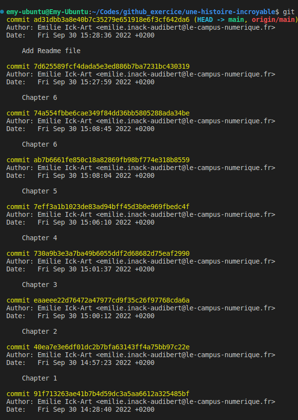

# Travail fait pendant la remise à niveau GIT/GITHUB

## JOUR 1

### How to add an image on a markdown file

There is two ways to add an image :
- inline-style
- reférence-style

*inline-style*

### Git tag : 

## Jour 2 

### Travail du groupe Michelle, Romain, Zackaria, Emilie

[lien du repos de groupe](https://github.com/E-IckArt/git-cda-2023-sample_forked.git)

[voir le déploiement](https://e-ickart.github.io/git-cda-2023-sample_forked/) 
